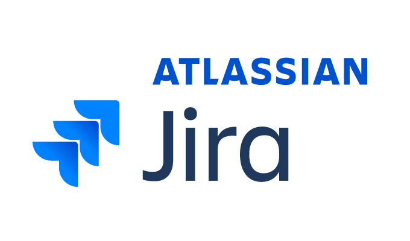

# Full Stack Developer

Professional software developer focused on delivering fluid web based applications leveraging the latest technologies and frameworks.

Connect with me: 
- [LinkedIn](https://www.linkedin.com/in/rory-o-brien-683901b8)

## Languages, Tools & Frameworks:

### Fontend

<table padding="10">
    <tr>
        <td>
             <a href="https://www.typescriptlang.org/" target="_blank" rel="noreferrer">
                
                Typescript
            </a>
        </td>
        <td>
               <a href="https://www.javascript.com/" target="_blank" rel="noreferrer">
                    
                    Javascript
                </a>
        </td>
        <td>
               <a href="https://angular.io" target="_blank" rel="noreferrer"> Angular</a>
        </td>
        <td>
              <a href="https://www.w3.org/html/" target="_blank" rel="noreferrer"> HTML5</a>
        </td>
        <td>
              <a href="https://sass-lang.com" target="_blank" rel="noreferrer"> Sass</a>
        </td>
    </tr>
    <tr>
        <td>
               <a href="https://getbootstrap.com" target="_blank" rel="noreferrer"> Bootstrap</a>
        </td>
        <td>
               	<a href="https://www.w3schools.com/css/" target="_blank" rel="noreferrer"> CSS</a>
        </td>
        <td>
             <a href="https://reactjs.org/" target="_blank" rel="noreferrer"> React</a>
        </td>
        <td>
             <a href="https://reactnative.dev/" target="_blank" rel="noreferrer"> React Native</a>
        </td>
        <td>
               <a href="https://redux.js.org" target="_blank" rel="noreferrer"> Redux</a>
        </td>
    </tr>
    <tr>
        <td>
            <a href="https://tailwindcss.com/" target="_blank" rel="noreferrer"> Tailwind</a>
        </td>
        <td>
            <a href="https://vuejs.org/" target="_blank" rel="noreferrer"> Vue</a>
        </td>
        <td>
              <a href="https://webpack.js.org" target="_blank" rel="noreferrer"> Webpack</a>
        </td>
    </tr>
</table>

### Backend

<table>

<tr>
    <td>
        <a href="https://php.net/" target="_blank" rel="noreferrer">
            
            PHP
        </a>
    </td>
    <td>
         <a href="https://expressjs.com" target="_blank" rel="noreferrer"> 
         
        Express
       </a>
    </td>
    <td>
         <a href="https://www.mysql.com/" target="_blank" rel="noreferrer"> SQL</a>
    </td>
    <td>
        <a href="https://nextjs.org/" target="_blank" rel="noreferrer"> Next Js </a>
    </td>
    <td>
        <a href="https://www.nginx.com" target="_blank" rel="noreferrer"> Nginx</a>
    </td>
</tr>
<tr>
    <td>
         	<a href="https://nodejs.org" target="_blank" rel="noreferrer"> Node.js</a>
    </td>
    <td>
         <a href="https://laravel.com/" target="_blank" rel="noreferrer"> Laravel</a>
    </td>
    <td>
           <a href="https://www.gnu.org/software/bash/" target="_blank" rel="noreferrer">Bash</a>
    </td>
</tr>

</table>

### Integration, Tooling & API's

<table>
    <tr>
        <td>
            <a href="https://aws.amazon.com/" target="_blank" rel="noreferrer">
                
                AWS
            </a>
        </td>
        <td>
	        <a href="https://jestjs.io" target="_blank" rel="noreferrer">  Jest</a>
        </td>
        <td>
	        <a href="https://www.atlassian.com/software/jira" target="_blank" rel="noreferrer"> Jira</a>
        </td>
        <td>
	        <a href="https://stripe.com/en-de" target="_blank" rel="noreferrer"> Jira</a>
        </td>
    </tr>
</table>

## Public Projects

**OBRSOUND**   https://obrsound.com   A web application that allows me to licence music and sell the licences online.

Features

-   React Typescript Front End
-   Universally rendered in PHP (Laravel)
-   Levarges Tailwind CSS framework
-   Interacts with the stripe payments API
-   MySQL databse
-   Authentication
-   SPA
-   Custom CLI scripts for pulling products and converting them into database records  

**SpotifyTopTracks**   https://spotifytoptracks.vercel.app/   A web application that interacts with the Spotify Web API to display a list of the users top played tracks over the previous 6 months.

Features

-   React Typescript Front End
-   Interacts with the Spotify Web API
-   Oauth via Spoity API
-   Custom react audio player with volume control  